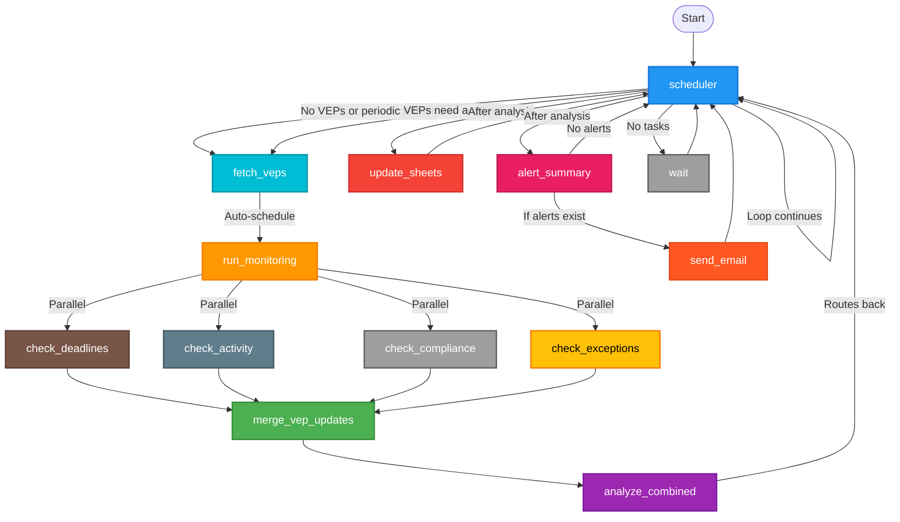

# VEP Police Agent

An AI-powered governance agent for monitoring and managing KubeVirt [Virtualization Enhancement Proposals](https://github.com/kubevirt/enhancements)
(VEPs).
This agent continuously tracks VEP progress, monitors compliance, checks deadlines,
and maintains a Google Sheets dashboard with real-time VEP status.

## Purpose

The VEP Police Agent automates the monitoring and governance of the KubeVirt VEP process by:

- **Discovering and tracking all VEPs** from GitHub issues and documentation
- **Monitoring compliance** with VEP process requirements (SIG sign-offs, template completeness, etc.)
- **Tracking deadlines** (Enhancement Freeze, Code Freeze) and sending alerts
- **Monitoring activity** on VEPs and flagging inactive ones
- **Maintaining a Google Sheets dashboard** with comprehensive VEP status
- **Detecting exceptions** and tracking post-freeze work
- **Sending email alerts** for deadline warnings, compliance issues, low activity, and risk indicators

The agent uses Large Language Models (LLMs) via Google's Gemini API to intelligently analyze VEP data, GitHub issues, and PRs, making it capable of understanding context and making nuanced decisions about VEP status and compliance.

## Features

- 🤖 **AI-Powered Analysis**: Uses Gemini models to intelligently analyze VEP data and GitHub content
- 📊 **Google Sheets Integration**: Maintains a real-time dashboard with VEP status, compliance flags, and alerts
- 📧 **Email Alerts**: Sends structured email notifications for deadlines, compliance issues, low activity, and risks
- 🔍 **Comprehensive VEP Discovery**: Finds VEPs from GitHub issues, PRs, and documentation files
- ⏰ **Deadline Monitoring**: Tracks Enhancement Freeze (EF) and Code Freeze (CF) dates from release schedules
- ✅ **Compliance Checking**: Verifies SIG sign-offs, template completeness, and process adherence
- 📈 **Activity Monitoring**: Flags inactive VEPs and tracks review lag times
- 🔄 **Continuous Operation**: Runs continuously or in one-cycle mode for scheduled jobs
- 🚀 **Containerized**: Runs in Podman/Docker containers for easy deployment
- 🔐 **MCP Integration**: Uses Model Context Protocol (MCP) for GitHub and Google Sheets access

## Requirements

- Python 3.11+
- Podman or Docker (for containerized execution)
- Google Gemini API key
- Google Service Account credentials (for Google Sheets access)
- GitHub Personal Access Token (optional, but recommended for higher rate limits)

## Installation

### 1. Clone the Repository

```bash
git clone <repository-url>
cd vep-police-agent
```

### 2. Install Dependencies

```bash
pip install -r requirements.txt
```

### 3. Set Up Credentials

Create the following files in the project root:

**API_KEY**: Your Google Gemini API key
```bash
echo "your-gemini-api-key" > API_KEY
```

**GOOGLE_TOKEN**: Google Service Account JSON credentials for Google Sheets access
```bash
# Copy your service account JSON file content to GOOGLE_TOKEN
cat path/to/service-account.json > GOOGLE_TOKEN
```

**GITHUB_TOKEN** (optional but recommended): GitHub Personal Access Token
```bash
echo "your-github-token" > GITHUB_TOKEN
```

**RESEND_API_KEY** (optional, required for email alerts): Resend API key for sending emails
```bash
# Get free API key from https://resend.com/api-keys
echo "re_..." > RESEND_API_KEY
```

### 4. Build Container Image (Optional)

If you want to run in a container:

```bash
cd container
./build-and-push.sh
```

## Usage

### Running Locally

```bash
python main.py \
    --api-key API_KEY \
    --google-token GOOGLE_TOKEN \
    --github-token GITHUB_TOKEN \
    --sheet-id YOUR_SHEET_ID
```

### Running in Container

The easiest way is to use the provided scripts:

```bash
# Run one cycle and exit (useful for cron jobs)
./scripts/run-one-cycle.sh

# Run continuously
./scripts/run-latest-agent.sh

# Create systemd unit for running as a service
sudo ./scripts/create-systemd-unit.sh

# After creating the unit:
sudo systemctl start vep-police-agent
sudo systemctl enable vep-police-agent  # Auto-start on boot
journalctl -u vep-police-agent -f      # View logs

# Delete the systemd unit
sudo ./scripts/create-systemd-unit.sh --delete
```

**Raw Container Run** (using podman/docker directly):

```bash
# From the project root directory
podman run --rm --pull=newer \
    -v "$(pwd):/workspace:ro" \
    -w /workspace \
    quay.io/mabekitzur/vep-police-agent:latest \
    --api-key /workspace/API_KEY \
    --google-token /workspace/GOOGLE_TOKEN \
    --github-token /workspace/GITHUB_TOKEN \
    --sheet-id YOUR_SHEET_ID \
    --one-cycle
```

**Note**: 
- `-v "$(pwd):/workspace:ro"` mounts your project directory (where API_KEY, GOOGLE_TOKEN files are) into the container as read-only
- `-w /workspace` sets the working directory so `/workspace/API_KEY` paths work correctly
- Run this from the project root directory where your credential files are located

### Command Line Options

- `--api-key PATH`: Path to Google Gemini API key file
- `--google-token PATH`: Path to Google Service Account JSON file
- `--github-token PATH`: Path to GitHub Personal Access Token file (optional but recommended)
- `--resend-api-key PATH`: Path to Resend API key file for email sending (get free key at https://resend.com/api-keys)
- `--sheet-id ID`: Google Sheets document ID (from URL: `https://docs.google.com/spreadsheets/d/{ID}/edit`)
- `--one-cycle`: Run one cycle and exit after sheet update completes
- `--immediate-start`: Run the first cycle immediately without waiting for round hour. Subsequent cycles will use current time + interval instead of round hours (useful for testing and one-time runs)
- `--skip-monitoring`: Skip all monitoring checks (deadlines, activity, compliance, exceptions) for faster debugging
- `--skip-sheets`: Skip Google Sheets updates (useful for testing email alerts)
- `--skip-send-email`: Skip sending email alerts (useful for debugging without sending emails)
- `--fastest-model`: Force all nodes to use `GEMINI_3_FLASH_PREVIEW` (fastest model)
- `--mock-veps`: Use mock VEPs instead of fetching from GitHub (useful for testing without API calls)
- `--mock-analyzed-combined`: Skip LLM call in analyze_combined node and use naive analysis (faster testing)
- `--mock-alert-summary`: Skip LLM call in alert_summary node and create mocked alerts (faster testing)
- `--debug MODE`: Enable debug mode (`discover-veps` or `test-sheets`)
- `--index-cache-minutes MINUTES`: Maximum age of index cache in minutes (default: 60)
- `--no-index-cache`: Disable index caching

### Debug Modes

**Discover VEPs** (indexes and prints VEP data, then exits):
```bash
./scripts/debug/debug-vep-index.sh
```

**Test Sheets** (tests Google Sheets integration with mock data):
```bash
./scripts/debug/debug-test-sheets.sh
```

**Test Email** (tests email alert functionality with mock data):
```bash
./scripts/debug/debug-test-email.sh
```

## Configuration

### Model Selection

Models are configured per node in `config.py`. By default:
- **Fast nodes**: Use `GEMINI_3_FLASH_PREVIEW` (check_activity, check_compliance, etc.)
- **Deep reasoning nodes**: Use `GEMINI_3_PRO_PREVIEW` (analyze_combined, merge_vep_updates, update_sheets, alert_summary)

Use `--fastest-model` to override all nodes to use the fastest model for testing.

### Google Sheets Setup

1. Create a Google Sheet (or use an existing one)
2. Share it with your service account email (found in `GOOGLE_TOKEN`)
3. Grant **Editor** access
4. Copy the Sheet ID from the URL: `https://docs.google.com/spreadsheets/d/{SHEET_ID}/edit`
5. Pass the Sheet ID with `--sheet-id` or set `SHEET_ID` environment variable

### Email Alerts Configuration

Email alerts are configured in `config.py`:

```python
EMAIL_RECIPIENTS = [
    "iholder@redhat.com",
    "user2@example.com",
]
```

Or set `EMAIL_RECIPIENTS` environment variable (comma-separated):
```bash
export EMAIL_RECIPIENTS='user1@example.com,user2@example.com'
```

**Email Setup** (required for sending email alerts):

The agent uses [Resend](https://resend.com) for email delivery (easiest setup):
1. Sign up for a free account at https://resend.com
2. Get your API key from https://resend.com/api-keys
3. Create `RESEND_API_KEY` file with your API key: `echo "re_..." > RESEND_API_KEY`
4. Free tier: 3,000 emails/month, no domain verification needed for basic sending

**Alert Types**:
- `deadline_approaching`: Deadlines (EF, CF) approaching or passed
- `low_activity`: VEP has low/no activity (inactive, stale)
- `compliance_issue`: VEP has compliance problems (missing sign-offs, incomplete template, etc.)
- `risk`: VEP is at risk, requires exception, or has other risk indicators
- `status_change`: VEP status changed (new VEP, status update, etc.)
- `milestone_update`: VEP milestone status changed

### Scheduling Configuration

The agent runs operations on configurable intervals. By default, all operations run on round hours (e.g., 13:00, 14:00, 15:00):

- **Fetch VEPs**: Every 1 hour (configurable via `FETCH_VEPS_INTERVAL_SECONDS` in `config.py`)
- **Update Sheets**: Every 1 hour (configurable via `UPDATE_SHEETS_INTERVAL_SECONDS` in `config.py`)
- **Alert Summary**: Every 1 hour (configurable via `ALERT_SUMMARY_INTERVAL_SECONDS` in `config.py`)

**Round-Hour Scheduling**: By default, operations wait until the next round hour (e.g., if it's 13:45, operations wait until 14:00). Use `--immediate-start` to run the first cycle immediately and use interval-based timing (current time + interval) instead of round hours.

### Index Caching

The agent caches indexed VEP data to avoid redundant API calls:
- Cache file: `.vep_index_cache.json` (added to `.gitignore`)
- Default cache age: 60 minutes
- Use `--no-index-cache` to disable caching
- Use `--index-cache-minutes` to adjust cache duration

## Architecture

The agent is built using **LangGraph** for orchestration and follows a node-based architecture:

### Node Graph

The agent's execution flow is orchestrated by a central scheduler that routes to different nodes:



**Flow Description:**
1. **Entry Point**: The `scheduler` node is the central coordinator and entry point
2. **VEP Discovery**: Routes to `fetch_veps` in two cases:
   - **Priority**: If no VEPs exist (immediate fetch on first run)
   - **Periodic**: Every configured interval (default: 1 hour) to refresh and discover new VEPs
3. **Automatic Analysis Pipeline**: After `fetch_veps` completes, the scheduler automatically schedules `run_monitoring` to ensure VEPs always go through the full analysis pipeline before updating sheets or sending emails
4. **Parallel Monitoring**: `run_monitoring` triggers four parallel checks:
   - `check_deadlines`: Tracks EF/CF deadlines
   - `check_activity`: Monitors VEP activity
   - `check_compliance`: Verifies process compliance
   - `check_exceptions`: Monitors exceptions
5. **Merge & Analyze**: All parallel checks converge to `merge_vep_updates`, then `analyze_combined` for holistic analysis
6. **Post-Analysis Actions**: After `analyze_combined` completes, it routes back to `scheduler`, which automatically schedules both `update_sheets` and `alert_summary` in parallel:
   - `update_sheets`: Updates Google Sheets with VEP status
   - `alert_summary`: Composes structured alerts from VEP analysis
7. **Email Alerts**: `alert_summary` conditionally routes to `send_email` (if alerts exist) or back to `scheduler` (if no alerts)
8. **Wait Loop**: If no tasks, waits until next round hour (or next interval if `--immediate-start` is used) before returning to scheduler (continuous operation)

**Key Design Principles:**
- **Analysis Pipeline Enforcement**: VEPs must always go through `fetch_veps → run_monitoring → merge_vep_updates → analyze_combined` before updating sheets or sending emails
- **Parallel Execution**: `update_sheets` and `alert_summary` run in parallel after analysis completes for efficiency
- **Scheduler-Driven**: The scheduler is the central coordinator that ensures proper sequencing and prevents skipping the analysis pipeline

## Troubleshooting

### Google Sheets Access Denied

If you see "Requested entity was not found":
1. Ensure the sheet is shared with your service account email
2. Grant **Editor** access (not just Viewer)
3. Verify the Sheet ID is correct

### Rate Limit Errors

GitHub API rate limits:
- Without token: 60 requests/hour (IP-based)
- With token: 5000 requests/hour

The agent includes retry logic with exponential backoff for rate limit errors.

### Index Cache Issues

If VEP discovery seems stale:
- Use `--no-index-cache` to force fresh indexing
- Delete `.vep_index_cache.json` manually
- Adjust `--index-cache-minutes` for your needs

## Credits

This project was developed with **heavy use of Cursor**, an AI-powered code editor. Cursor's advanced code generation, refactoring, and debugging capabilities were instrumental in implementing the complex agent logic, MCP integrations, and LangGraph orchestration. The iterative development process, prompt-driven code generation, and intelligent code completion provided by Cursor significantly accelerated the development of this agent.

## License

[Add your license here]

## Contributing

[Add contribution guidelines here]
