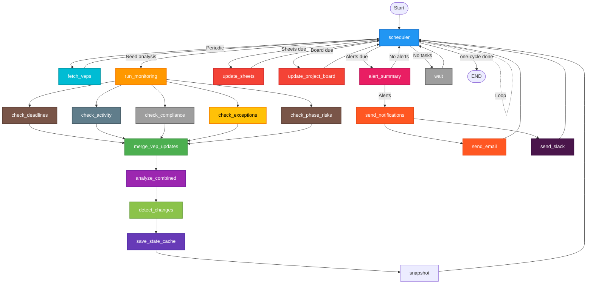

# VEP Police Agent

AI-powered governance agent for monitoring KubeVirt [Virtualization Enhancement Proposals](https://github.com/kubevirt/enhancements) (VEPs).

**What it does:**
- Maintains a [Google Sheet dashboard](https://docs.google.com/spreadsheets/d/12evICwzi3Hpkbc3vWLp6pKEQNz7G3yFblWP2b764et4) and a [GitHub Project board](https://github.com/orgs/kubevirt/projects/21) with real-time VEP status.
- Sends Slack alerts ([#kubevirt-vep-agent-alerts](https://cloud-native.slack.com/archives/C0A99UAFW1M) channel on the CNCF Slack)
- Send email summaries.
  - currently only to iholder101. Will resolve this limitation moving forward.
- Uses Gemini LLMs to analyze VEP data, check compliance, track deadlines, and flag risks.

**Key capabilities:**
- Discovers VEPs from GitHub issues, PRs, and docs.
- Monitors compliance (SIG sign-offs, template completeness).
- Tracks Enhancement Freeze (EF) and Code Freeze (CF) deadlines.
- Flags inactive VEPs and escalates persistent issues.
- Runs continuously or as one-shot (for cron jobs).

## Architecture

The agent is built using **LangGraph** for orchestration and follows a node-based architecture:

### Node Graph

The agent's execution flow is orchestrated by a central scheduler that routes to different nodes:


```mermaid
graph TD
    Start([Start]) --> Scheduler[scheduler]

    Scheduler -->|Periodic| FetchVEPs[fetch_veps]
    Scheduler -->|Need analysis| RunMonitoring[run_monitoring]
    Scheduler -->|Sheets due| UpdateSheets[update_sheets]
    Scheduler -->|Board due| UpdateBoard[update_project_board]
    Scheduler -->|Alerts due| AlertSummary[alert_summary]
    Scheduler -->|No tasks| Wait[wait]
    Scheduler -->|one-cycle done| End([END])

    FetchVEPs --> Scheduler

    RunMonitoring --> CheckDeadlines[check_deadlines]
    RunMonitoring --> CheckActivity[check_activity]
    RunMonitoring --> CheckCompliance[check_compliance]
    RunMonitoring --> CheckExceptions[check_exceptions]
    RunMonitoring --> CheckPhaseRisks[check_phase_risks]

    CheckDeadlines --> MergeUpdates[merge_vep_updates]
    CheckActivity --> MergeUpdates
    CheckCompliance --> MergeUpdates
    CheckExceptions --> MergeUpdates
    CheckPhaseRisks --> MergeUpdates

    MergeUpdates --> AnalyzeCombined[analyze_combined]
    AnalyzeCombined --> DetectChanges[detect_changes]
    DetectChanges --> SaveStateCache[save_state_cache]
    SaveStateCache --> Snapshot[snapshot]
    Snapshot --> Scheduler

    AlertSummary -->|Alerts| SendNotifications[send_notifications]
    AlertSummary -->|No alerts| Scheduler

    SendNotifications --> SendEmail[send_email]
    SendNotifications --> SendSlack[send_slack]

    UpdateSheets --> Scheduler
    UpdateBoard --> Scheduler
    SendEmail --> Scheduler
    SendSlack --> Scheduler
    Wait --> Scheduler

    Scheduler -.->|Loop| Scheduler

    style Scheduler fill:#2196F3,stroke:#1976D2,stroke-width:2px,color:#fff
    style RunMonitoring fill:#FF9800,stroke:#F57C00,stroke-width:2px,color:#fff
    style MergeUpdates fill:#4CAF50,stroke:#388E3C,stroke-width:2px,color:#fff
    style AnalyzeCombined fill:#9C27B0,stroke:#7B1FA2,stroke-width:2px,color:#fff
    style DetectChanges fill:#8BC34A,stroke:#689F38,stroke-width:2px,color:#fff
    style SaveStateCache fill:#673AB7,stroke:#512DA8,stroke-width:2px,color:#fff
    style UpdateSheets fill:#F44336,stroke:#D32F2F,stroke-width:2px,color:#fff
    style UpdateBoard fill:#F44336,stroke:#D32F2F,stroke-width:2px,color:#fff
    style FetchVEPs fill:#00BCD4,stroke:#0097A7,stroke-width:2px,color:#fff
    style CheckDeadlines fill:#795548,stroke:#5D4037,stroke-width:2px,color:#fff
    style CheckActivity fill:#607D8B,stroke:#455A64,stroke-width:2px,color:#fff
    style CheckCompliance fill:#9E9E9E,stroke:#616161,stroke-width:2px,color:#fff
    style CheckExceptions fill:#FFC107,stroke:#F57C00,stroke-width:2px,color:#000
    style CheckPhaseRisks fill:#795548,stroke:#5D4037,stroke-width:2px,color:#fff
    style AlertSummary fill:#E91E63,stroke:#C2185B,stroke-width:2px,color:#fff
    style SendNotifications fill:#FF5722,stroke:#E64A19,stroke-width:2px,color:#fff
    style SendEmail fill:#FF5722,stroke:#E64A19,stroke-width:2px,color:#fff
    style SendSlack fill:#4A154B,stroke:#3C1042,stroke-width:2px,color:#fff
    style Wait fill:#9E9E9E,stroke:#616161,stroke-width:2px,color:#fff
```

**Flow Summary:**
1. `scheduler` coordinates all operations on configurable intervals.
2. `fetch_veps` discovers VEPs from GitHub and returns to scheduler.
3. Scheduler routes to `run_monitoring`, which fans out to five parallel check nodes (deadlines, activity, compliance, exceptions, phase risks) using Flash model.
4. `merge_vep_updates` combines context data (deterministic, no LLM).
5. `analyze_combined` (Pro model) does cross-domain reasoning and generates alerts. Uses the previous release's code freeze date to distinguish current-release vs previous-release PRs - VEPs with only old PRs are flagged instead of shown as complete.
6. `detect_changes` compares to previous run for accurate change reporting.
7. `update_sheets`, `update_project_board`, and `alert_summary` run on schedule; alerts fan out to email and Slack.

## Requirements

- Python 3.11+ (or Podman/Docker).
- Google Gemini API key.
- Google Service Account credentials (for Sheets).
- GitHub PAT (optional, recommended for rate limits).
- Resend API key (optional, for email).
- Slack Webhook URL (optional, for Slack).

## Installation

```bash
git clone <repository-url>
cd vep-police-agent
pip install -r requirements.txt
```

**Credentials** - create these files in the project root:

| File | Content |
|------|---------|
| `API_KEY` | Gemini API key |
| `GOOGLE_TOKEN` | Service account JSON |
| `GITHUB_TOKEN` | GitHub PAT (optional) |
| `RESEND_API_KEY` | Resend API key (optional) |
| `SLACK_WEBHOOK_URL` | Slack webhook URL (optional) |

**Container build** (optional): `cd container && ./build-and-push.sh`

## Usage

### Running Locally

```bash
python main.py \
    --api-key API_KEY \
    --google-token GOOGLE_TOKEN \
    --github-token GITHUB_TOKEN \
    --sheet-id YOUR_SHEET_ID
```

### Running in Container

The easiest way is to use the provided scripts:

```bash
# Run one cycle and exit (useful for cron jobs)
./scripts/run-one-cycle.sh

# Run continuously
./scripts/run-latest-agent.sh

# Create systemd unit for running as a service
sudo ./scripts/create-systemd-unit.sh

# After creating the unit:
sudo systemctl start vep-police-agent
sudo systemctl enable vep-police-agent  # Auto-start on boot
journalctl -u vep-police-agent -f      # View logs

# Delete the systemd unit
sudo ./scripts/create-systemd-unit.sh --delete
```

**Raw Container Run** (using podman/docker directly):

```bash
# From the project root directory
podman run --rm --pull=newer \
    -v "$(pwd):/workspace:ro" \
    -v "$(pwd)/cache:/workspace/cache:rw" \
    -v "$(pwd)/output:/workspace/output:rw" \
    -w /workspace \
    quay.io/mabekitzur/vep-police-agent:latest \
    --api-key /workspace/API_KEY \
    --google-token /workspace/GOOGLE_TOKEN \
    --github-token /workspace/GITHUB_TOKEN \
    --sheet-id YOUR_SHEET_ID \
    --one-cycle
```

**Note**:
- `-v "$(pwd):/workspace:ro"` mounts your project directory as read-only (credentials stay secure)
- `-v "$(pwd)/cache:/workspace/cache:rw"` mounts cache directory as read-write for persistence
- `-v "$(pwd)/output:/workspace/output:rw"` mounts output directory for status snapshots
- `-w /workspace` sets the working directory so `/workspace/API_KEY` paths work correctly
- Run this from the project root directory where your credential files are located

### Command Line Options

**Credentials:**
| Flag | Description |
|------|-------------|
| `--api-key PATH` | Gemini API key file |
| `--google-token PATH` | Google Service Account JSON file |
| `--github-token PATH` | GitHub PAT file (optional, recommended) |
| `--resend-api-key PATH` | Resend API key for email |
| `--slack-webhook-url PATH` | Slack webhook URL file |
| `--sheet-id ID` | Google Sheets ID (from URL) |

**Execution modes:**
| Flag | Description |
|------|-------------|
| `--one-cycle` | Run once and exit |
| `--immediate-start` | Start immediately (don't wait for round hour) |
| `--debug MODE` | Debug mode: `discover-veps` or `test-sheets` |

**Skip flags** (for testing/debugging):
| Flag | Description |
|------|-------------|
| `--skip-monitoring` | Skip all monitoring checks |
| `--skip-sheets` | Skip Google Sheets updates |
| `--skip-send-email` | Skip email alerts |
| `--skip-send-slack` | Skip Slack alerts |

**Mock/test flags:**
| Flag | Description |
|------|-------------|
| `--fastest-model` | Use Flash model for all nodes |
| `--mock-veps` | Use mock VEPs (no GitHub fetch) |
| `--mock-analyzed-combined` | Skip LLM in analyze node |
| `--mock-alert-summary` | Skip LLM in alert node |
| `--use-state-cache` | Use cached state from previous run |

**Cache control:**
| Flag | Description |
|------|-------------|
| `--index-cache-minutes N` | Cache age in minutes (default: 60) |
| `--no-index-cache` | Disable index caching |
| `--clear-history` | Clear all caches and exit |

### Debug Modes

**Discover VEPs** (indexes and prints VEP data, then exits):
```bash
./scripts/debug/debug-vep-index.sh
```

**Test Sheets** (tests Google Sheets integration with mock data):
```bash
./scripts/debug/debug-test-sheets.sh
```

**Test Email** (tests email alert functionality with mock data):
```bash
./scripts/debug/debug-test-email.sh
```

**Test Slack** (tests Slack alert functionality with mock data):
```bash
./scripts/debug/debug-test-slack.sh
```

## Configuration

### Models

Two-tier approach configured in `config.py`:
- **Flash** (fast): Fetch nodes (`fetch_veps`, `check_*`).
- **Pro** (powerful): Analysis nodes (`analyze_combined`, `update_sheets`, `alert_summary`).

Override models via environment variables:
- `FAST_MODEL` (default: `gemini-3-flash-preview`)
- `HEAVY_MODEL` (default: `gemini-3.1-pro-preview`)
- `DEFAULT_MODEL` (default: same as `FAST_MODEL`)

Use `--fastest-model` to force Flash everywhere for testing.

### Google Sheets

1. Share your sheet with the service account email (from `GOOGLE_TOKEN`).
2. Grant **Editor** access.
3. Pass sheet ID via `--sheet-id` (from URL: `docs.google.com/spreadsheets/d/{ID}/edit`).

### Email (Resend)

1. Get free API key from https://resend.com/api-keys.
2. Save to `RESEND_API_KEY` file.
3. Configure recipients in `config.py` or via `EMAIL_RECIPIENTS` env var.

### Slack

1. Create webhook at https://api.slack.com/apps → Incoming Webhooks.
2. Save URL to `SLACK_WEBHOOK_URL` file.

Alerts are color-coded by severity (Critical=red, High=orange, Medium=yellow, Low=green).

### Scheduling

All operations run every 4 hours on round hours by default. Configure intervals in `config.py` (`FETCH_VEPS_INTERVAL_SECONDS`, etc.). Use `--immediate-start` to skip waiting for round hour.

### Caching

Cache files in `cache/` directory:
- `index_cache.json`: VEP data from GitHub (default: 60 min).
- `state_cache.json`: State snapshot for `--use-state-cache`.
- `history/`: Snapshots for change detection (keeps last 24).
- `alert_persistence.json`: Tracks escalation logic.

Use `--clear-history` for a fresh start.

## Status Snapshots & Diff-Based Testing

Each agent cycle produces deterministic output files in `output/`:

| File | Description |
|------|-------------|
| `vep_snapshot_YYYYMMDD_HHMM.yaml` | Timestamped VEP status (sorted, fixed field order). Last 10 kept. |
| `realizations.txt` | Changes vs previous run + anomaly flags |

**Diff-based review workflow:**

```bash
# Diff the two most recent snapshots
diff output/vep_snapshot_20260330_1400.yaml output/vep_snapshot_20260331_1400.yaml

# Or read the realizations file directly (auto-diffs the last two snapshots)
cat output/realizations.txt
```

The realizations file flags anomalies automatically (VEPs disappearing, PR counts
decreasing, compliance regressions, large merge probability swings) - no LLM involved,
purely deterministic checks.

**Snapshot validation** (integration test equivalent):

```bash
# Run a full cycle with output-only flags
python main.py --one-cycle \
  --api-key API_KEY --google-token GOOGLE_TOKEN \
  --github-token GITHUB_TOKEN --skip-sheets --skip-send-email \
  --skip-send-slack --skip-update-board

# Verify output files exist and look correct
ls output/vep_snapshot_*.yaml
cat output/realizations.txt
```

## Troubleshooting

| Issue | Solution |
|-------|----------|
| Sheets "entity not found" | Share sheet with service account email, grant Editor access |
| GitHub rate limits | Add `GITHUB_TOKEN` (5000 req/hr vs 60 without) |
| Stale VEP data | Use `--no-index-cache` or delete `cache/index_cache.json` |

## Credits

Developed with **Cursor** and **Claude Code**. PR tracking patterns inspired by [vladikr/vepMonitoring](https://github.com/vladikr/vepMonitoring).

## License

[Add your license here]

## Contributing

[Add contribution guidelines here]
