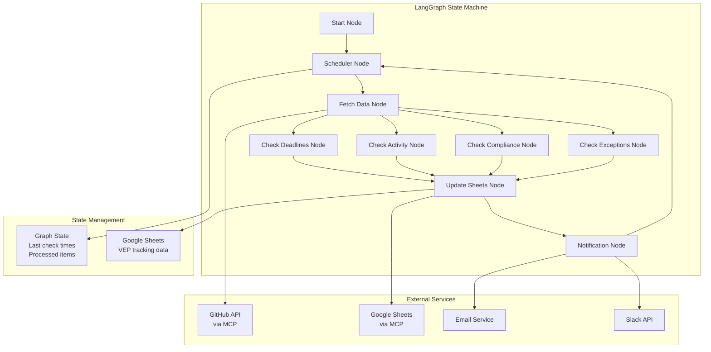

# VEP Governance Agent Architecture Plan

## Architecture Overview

The agent will be built as a **LangGraph state machine** with specialized nodes for each monitoring task. It runs continuously, periodically checking VEP status and responding to events. State is maintained in Google Sheets and the graph's internal state.

## High-Level Architecture



## Core Components

### 1. State Schema (`state.py`)

Define the graph state structure:

- `messages`: Conversation history (for LLM interactions)
- `current_release`: Active release version (e.g., "v1.8")
- `release_schedule`: Parsed schedule data
- `veps`: List of VEP data structures
- `last_check_times`: Dict of last check timestamps per task
- `alerts`: List of alerts to send
- `sheets_updated`: Boolean flag for sheet updates

### 2. Data Fetching Node (`nodes/fetch_data.py`)

- Fetch current release schedule from `kubevirt/sig-release`
- Fetch VEP documents from `kubevirt/enhancements/veps/`
- Fetch issues and PRs from GitHub (via MCP)
- Parse and normalize data into state
- Cache results with timestamps

### 3. Monitoring Nodes

#### Deadline Monitoring (`nodes/check_deadlines.py`)

- Calculate days until EF and CF from release schedule
- Check each VEP's target release against deadlines
- Generate alerts for approaching deadlines (7d, 3d, 1d)
- Flag VEPs that won't make deadlines

#### Activity Monitoring (`nodes/check_activity.py`)

- Check last update time for each VEP
- Flag inactive VEPs (>2 weeks)
- Monitor review lag times (>1 week)
- Track weekly SIG check-ins

#### Compliance Checking (`nodes/check_compliance.py`)

- Verify VEP template completeness
- Check SIG sign-offs (all 3 SIGs)
- Ensure VEPs merged before implementation PRs
- Validate labels and PR linking

#### Exception Tracking (`nodes/check_exceptions.py`)

- Monitor for post-freeze work without exceptions
- Track exception requests (from mailing list or issues)
- Verify exception completeness

### 4. State Management Node (`nodes/update_sheets.py`)

- Read current Google Sheets state
- Compare with graph state
- Update sheets with new/changed VEP data
- Maintain sync between graph state and sheets

### 5. Notification Node (`nodes/notify.py`)

- Process alerts from monitoring nodes
- Send emails for non-urgent issues
- Send Slack messages for urgent issues (<24h)
- Generate weekly summary reports

### 6. Scheduler Node (`nodes/scheduler.py`)

- Determine which tasks to run based on:
  - Time since last check
  - Event triggers
  - Task priorities
- Route to appropriate monitoring nodes
- Handle sleep/wait logic

## File Structure

```
vep-police-agent/
├── agent.py                 # Main entry point
├── graph.py                 # LangGraph definition
├── state.py                 # State schema
├── config.py                # Configuration management
├── nodes/
│   ├── __init__.py
│   ├── scheduler.py         # Task scheduling logic
│   ├── fetch_data.py        # Data fetching from GitHub
│   ├── check_deadlines.py   # Deadline monitoring
│   ├── check_activity.py    # Activity monitoring
│   ├── check_compliance.py  # Compliance checking
│   ├── check_exceptions.py  # Exception tracking
│   ├── update_sheets.py     # Google Sheets sync
│   └── notify.py            # Notification sending
├── services/
│   ├── __init__.py
│   ├── github.py            # GitHub API wrapper (using MCP)
│   ├── sheets.py            # Google Sheets wrapper (using MCP)
│   ├── email.py             # Email service
│   └── slack.py             # Slack API client
├── models/
│   ├── __init__.py
│   ├── vep.py               # VEP data model
│   └── schedule.py          # Release schedule parser
├── utils.py                 # Existing utilities
├── mcp_factory.py           # Existing MCP integration
└── agent.md                 # Existing documentation
```

## Implementation Strategy

### Phase 1: Core Infrastructure

1. Define state schema with TypedDict
2. Create basic graph structure with scheduler node
3. Set up configuration management (env vars, config file)
4. Implement GitHub data fetching using existing MCP tools

### Phase 2: Data Fetching & Parsing

1. Implement release schedule parser (markdown → structured data)
2. Implement VEP document parser
3. Build GitHub API wrappers using MCP tools
4. Add caching mechanism to avoid excessive API calls

### Phase 3: Monitoring Nodes

1. Implement deadline monitoring node
2. Implement activity monitoring node
3. Implement compliance checking node
4. Implement exception tracking node

### Phase 4: State Management

1. Implement Google Sheets integration using MCP
2. Build sync logic between graph state and sheets
3. Add conflict resolution for concurrent updates

### Phase 5: Notifications

1. Implement email service (SMTP or service like SendGrid)
2. Implement Slack API client
3. Build notification routing logic
4. Add weekly summary generation

### Phase 6: Continuous Execution

1. Build main event loop
2. Add graceful shutdown handling
3. Implement error recovery and retry logic
4. Add logging and monitoring

## Key Design Decisions

1. **State Management**: Use LangGraph's state for runtime data, Google Sheets for persistent storage
2. **MCP Integration**: Leverage existing MCP tools for GitHub and Google Sheets rather than direct API clients
3. **Modular Nodes**: Each monitoring task is a separate node for maintainability and testability
4. **LLM Usage**: Use LLM primarily for:

   - Parsing unstructured data (VEP documents, issue comments)
   - Generating human-readable notifications
   - Analyzing compliance (checking template completeness, understanding context)

5. **Caching**: Cache GitHub API responses to respect rate limits and reduce calls
6. **Error Handling**: Each node should handle errors gracefully and continue processing other VEPs

## Dependencies

- `langchain`: Core LangChain functionality
- `langgraph`: State machine framework
- `langchain-google-genai`: Google Gemini integration (already in use)
- `mcp`: Model Context Protocol (already in use)
- `python-dotenv`: Environment variable management
- `pydantic`: Data validation and models
- `schedule` or `apscheduler`: Task scheduling (if needed beyond LangGraph)
- Email: `smtplib` (built-in) or `sendgrid` package
- Slack: `slack-sdk` package

## Configuration

Environment variables needed:

- `GITHUB_TOKEN`: For GitHub API access
- `GOOGLE_CREDENTIALS`: For Google Sheets access
- `EMAIL_SMTP_HOST`, `EMAIL_SMTP_PORT`, `EMAIL_USER`, `EMAIL_PASSWORD`: Email config
- `SLACK_BOT_TOKEN`, `SLACK_CHANNEL`: Slack config
- `CHECK_INTERVAL`: How often to run checks (default: 3600 seconds)
- `SHEETS_ID`: Google Sheets document ID

## Next Steps

After plan approval, we'll start with Phase 1 (Core Infrastructure) and build incrementally, testing each phase before moving to the next.

TODO:
- [ ] Define state schema in state.py using TypedDict for graph state management
- [ ] Create config.py for environment variables and configuration management
- [ ] Create basic LangGraph structure in graph.py with scheduler node
- [ ] Create agent.py main entry point with continuous execution loop
- [ ] Create services/github.py wrapper using MCP tools for GitHub API access
- [ ] Create models/schedule.py for parsing release schedule markdown files
- [ ] Create models/vep.py for VEP data structure and parsing logic
- [ ] Implement nodes/fetch_data.py to fetch and parse VEP data from GitHub
- [ ] Implement nodes/check_deadlines.py for deadline monitoring and alert generation
- [ ] Implement nodes/check_activity.py for activity monitoring (inactive VEPs, review lag)
- [ ] Implement nodes/check_compliance.py for compliance checking (template, SIG sign-offs, labels)
- [ ] Implement nodes/check_exceptions.py for exception tracking
- [ ] Create services/sheets.py wrapper using MCP tools for Google Sheets access
- [ ] Implement nodes/update_sheets.py for syncing graph state with Google Sheets
- [ ] Create services/email.py for sending email notifications
- [ ] Create services/slack.py for sending Slack notifications
- [ ] Implement nodes/notify.py for processing alerts and sending notifications
- [ ] Enhance agent.py with proper event loop, error handling, and graceful shutdown