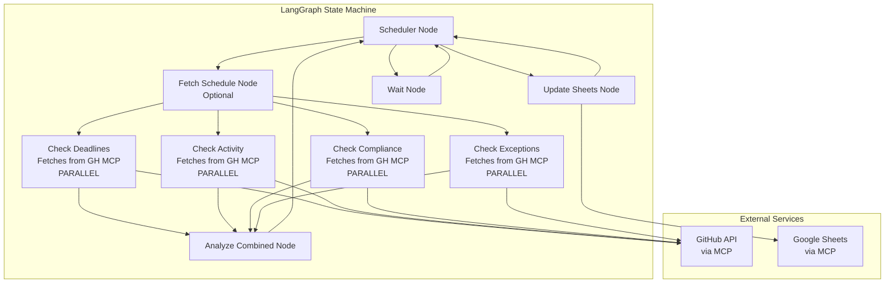

# VEP Governance Agent - Updated Architecture

## Architecture Overview

The agent uses a **hybrid architecture** with:

- **Self-contained monitoring checks** - each check fetches its own data from GitHub MCP
- **Parallel execution** for performance
- **Holistic analysis node** for cross-check reasoning
- **Scheduler-based coordination** for flexible routing

## Updated High-Level Architecture

## Key Architectural Decisions

### 1. Self-Contained Monitoring Checks

- **Each check node fetches its own data** from GitHub MCP tools
- No central `fetch_data` node - checks are independent
- Each check knows what data it needs and fetches it
- **Benefit**: Modular, testable, each check is self-contained

### 2. Optional Schedule Fetching

- `fetch_schedule` node (optional) can fetch release schedule once
- Or each check that needs schedule can fetch it
- Schedule is relatively static, so caching makes sense

### 3. Parallel Execution

- All monitoring checks run in parallel
- Each check updates different parts of state independently
- LangGraph automatically merges state updates
- **Benefit**: Faster execution, better resource utilization

### 4. Holistic Analysis Node

- Runs after all checks complete
- Can reason about combinations (e.g., "low activity + close deadline = urgent")
- Uses LLM for complex reasoning when needed
- Generates alerts based on combined context
- **Benefit**: Enables cross-check reasoning that individual checks can't do

### 5. Scheduler-Based Coordination

- Central decision point for routing
- Decides what to do after analysis (update sheets, notify, wait)
- Can route to individual checks if needed
- **Benefit**: Flexible, extensible, single point of control

## Data Fetching Strategy

### Each Check Node Fetches Its Own Data

**`check_deadlines`**:

- Fetches release schedule from `kubevirt/sig-release` (if not cached)
- Fetches VEP documents to get target releases
- Updates state with deadline calculations

**`check_activity`**:

- Fetches issue/PR updates from GitHub
- Fetches VEP tracking issues
- Calculates activity metrics

**`check_compliance`**:

- Fetches VEP PRs and reviews
- Fetches tracking issues for PR links
- Checks SIG sign-offs from PR comments
- Validates labels

**`check_exceptions`**:

- Fetches exception requests (from issues or mailing list)
- Checks for post-freeze work
- Validates exception completeness

### Optional: `fetch_schedule` Node

- Can fetch release schedule once and cache it
- Other checks can use cached schedule
- Reduces redundant API calls

## Current Focus: Google Sheets Integration

### Implementation Plan for `update_sheets`

**Phase 1: Google Sheets Service Wrapper**

- Create `services/sheets.py` using MCP tools
- Functions needed:
  - Read sheet data
  - Write/update sheet data
  - Find/create rows for VEPs
  - Handle sheet structure (headers, formatting)

**Phase 2: Sheet Structure Design**

- Define column structure matching VEP state:
  - VEP number, title, owner, owning SIG
  - Target release, status
  - Compliance flags (template, SIG sign-offs, etc.)
  - Activity metrics (last update, days since update)
  - Deadline info (days until EF/CF)
  - Alerts, exceptions
- Consider: Should we have separate sheets for different views?

**Phase 3: Sync Logic in `update_sheets` Node**

- Read current sheet state
- Compare with graph state
- Identify changes (new VEPs, updated VEPs, deleted VEPs)
- Update sheets efficiently (batch updates)
- Handle conflicts/errors gracefully

**Phase 4: State Reconciliation**

- When graph starts, optionally read from sheets to initialize state
- Handle cases where sheets have data graph doesn't
- Maintain sync consistency

## Implementation Status

### Completed

- ✅ State schema (`state.py`) - Complete with all models
- ✅ Basic graph structure with scheduler
- ✅ Wait node for continuous execution
- ✅ Logging infrastructure
- ✅ Node stubs for all monitoring checks

### In Progress

- 🔄 **Google Sheets integration** (current focus)

### Pending

- Monitoring check implementations (each fetches its own data from GitHub MCP)
- Analysis node implementation
- Notification system (email/Slack)

## Google Sheets Implementation Details

### Sheet Structure (Proposed)

| Column | Description | Source |

|--------|-------------|--------|

| VEP Number | e.g., "vep-1234" | `VEPInfo.name` |

| Title | VEP title | `VEPInfo.title` |

| Owner | GitHub username | `VEPInfo.owner` |

| Owning SIG | compute/network/storage | `VEPInfo.owning_sig` |

| Target Release | e.g., "v1.8" | `VEPInfo.target_release` |

| Status | Current status | `VEPInfo.status` |

| Last Updated | Timestamp | `VEPInfo.last_updated` |

| Days Since Update | Activity metric | `VEPInfo.activity.days_since_update` |

| Days Until EF | Deadline metric | `VEPInfo.deadlines.days_until_ef` |

| Days Until CF | Deadline metric | `VEPInfo.deadlines.days_until_cf` |

| Template Complete | Compliance flag | `VEPInfo.compliance.template_complete` |

| All SIGs Signed Off | Compliance flag | `VEPInfo.compliance.all_sigs_signed_off` |

| VEP Merged | Compliance flag | `VEPInfo.compliance.vep_merged` |

| PRs Linked | Compliance flag | `VEPInfo.compliance.prs_linked` |

| Docs PR Created | Compliance flag | `VEPInfo.compliance.docs_pr_created` |

| Labels Valid | Compliance flag | `VEPInfo.compliance.labels_valid` |

| Alerts | Alert summary | `VEPInfo` analysis |

| Notes | Free-form notes | `VEPInfo.notes` |

### Sync Strategy

1. **Read current sheet** → Parse into VEP-like structures
2. **Compare with graph state** → Identify:

   - New VEPs (in graph, not in sheet)
   - Updated VEPs (changed data)
   - Deleted VEPs (in sheet, not in graph) - handle carefully

3. **Batch updates** → Update all changes in one operation
4. **Error handling** → Log errors, continue with other VEPs

### MCP Tools for Google Sheets

Using `@modelcontextprotocol/server-google-sheets`:

- Need to identify which tools are available
- Likely: read range, write range, append rows, etc.
- Will need to handle authentication (GOOGLE_CREDENTIALS env var)

## Next Steps

1. **Implement `services/sheets.py`** - MCP wrapper for Google Sheets
2. **Design and create sheet structure** - Define columns, create template if needed
3. **Implement `update_sheets` node** - Full sync logic
4. **Test with real Google Sheet** - Verify sync works correctly
5. **Add error handling and logging** - Robust error recovery

## Configuration Needed

- `GOOGLE_CREDENTIALS`: Path to Google service account JSON or credentials
- `SHEETS_ID`: Google Sheets document ID (from URL)
- `SHEETS_RANGE`: Optional - specific range to read/write (default: entire sheet)
- `GITHUB_TOKEN`: For GitHub API access (used by check nodes)